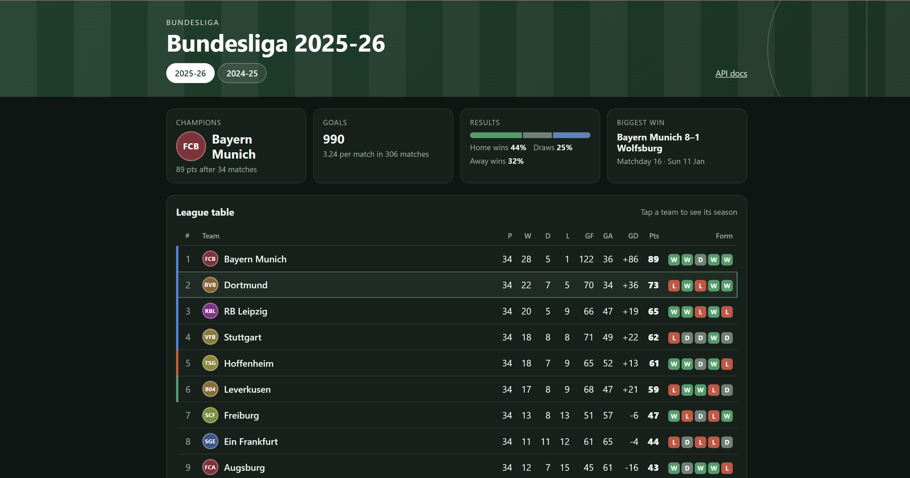
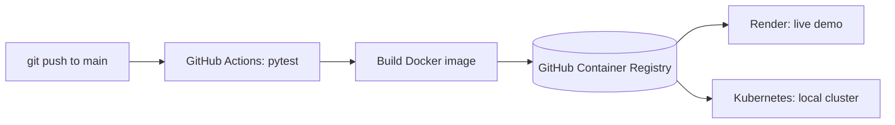

# Football API

A REST API and small web app for football results, built with FastAPI and loaded with **real Bundesliga data** (seasons 2024-25 and 2025-26, 612 matches). It computes league standings and stats, and ships with a tested, containerised CI/CD pipeline.

**Live demo:** https://football-api-latest-jyfo.onrender.com
*(hosted on a free plan: the first load can take up to a minute while the app wakes up)*



## What it does

- Stores teams and matches in a SQLite database (SQLAlchemy 2.0).
- Computes the league table for any season (3 points for a win, 1 for a draw; ties broken by goal difference, then goals scored).
- Computes stats, such as the strongest attacks of a season (`/stats/top-attacks`).
- Validates input (Pydantic): no negative goals, no team playing itself, and duplicate matches are rejected with HTTP 409.
- Imports matches from CSV files. The importer is idempotent, so running it twice never creates duplicates.
- Serves a single-page front end (HTML + JavaScript) with the standings table, matches per team and a position-by-matchday chart. The page gets all its data from the API.

## How it fits together



## API endpoints

| Method | Path | Description |
|---|---|---|
| GET | `/` | The web page |
| GET | `/health` | Liveness check |
| GET | `/seasons` | Seasons in the database (newest first) |
| GET | `/teams` | List of teams |
| GET | `/teams/{id}` | One team (404 if it does not exist) |
| GET | `/matches?season=&team=&limit=&offset=` | Matches with filters and pagination (limit up to 200) |
| POST | `/matches` | Add a match (422 for invalid data, 409 if it already exists) |
| GET | `/standings?season=2025-26` | League table (`season` is required) |
| GET | `/stats/top-attacks?season=2025-26&limit=5` | Teams with the most goals scored, with goals per match |

Interactive documentation (Swagger UI) is generated automatically at `/docs`.

## Run locally

Requires Python 3.12 or newer.

```bash
python -m venv .venv
.venv\Scripts\activate             # Windows
# source .venv/bin/activate        # Mac / Linux

pip install -r requirements-dev.txt
uvicorn app.main:app --reload
```

On startup the app loads `D1_2425.csv` and `D1.csv` from the project folder (already-imported matches are skipped). Open http://127.0.0.1:8000 for the page or http://127.0.0.1:8000/docs for the API.

To load another CSV manually:

```bash
python -m app.importer D1.csv --season 2025-26
```

## Data

Results come from [football-data.co.uk](https://www.football-data.co.uk) (Bundesliga CSV files). The importer reads the columns `Date`, `HomeTeam`, `AwayTeam`, `FTHG`, `FTAG`.

- `D1.csv`: Bundesliga 2025-26
- `D1_2425.csv`: Bundesliga 2024-25

For another season or league, download the matching CSV and pass the season name with `--season`. `sample_data/sample_matches.csv` contains fictional teams and is only for quick tests.

## Tests

```bash
pytest -v
```

Tests run against an in-memory database, so they never touch real data. They cover creating and listing matches, filters, standings, stats, validation rules and duplicate protection.

## Docker

```bash
docker build -t football-api .
docker run -d --name football-api -p 8000:8000 -v football-data:/app/data football-api
```

The CSV files are bundled into the image and loaded when the app starts. The `football-data` volume keeps the database even if the container is removed.

## CI/CD and Kubernetes

On every push to `main`, GitHub Actions:

1. runs the tests (pytest),
2. builds the Docker image,
3. publishes it to GitHub Container Registry (`ghcr.io/markapaa/football-api`).

The published image is what runs on the live demo. It can also run on a local Kubernetes cluster using the manifests in `k8s/`:

```bash
kubectl apply -f k8s/deployment.yaml
kubectl port-forward service/football-api 8080:80
```

Then open http://127.0.0.1:8080/health. The Deployment keeps the requested number of pods running and recreates any pod that is deleted.

`scripts/check.sh` is a small health check that reports whether the API is up.

## Limitations and next steps

- Each pod (or container) has its own SQLite file, so several replicas do not share data. For production I would move to a shared database such as PostgreSQL.
- The container runs as root. A non-root user would be the next hardening step.
- The Render service is redeployed manually when a new image is published.

## Project structure

```
app/
  main.py       endpoints
  schemas.py    input/output validation (Pydantic)
  models.py     database tables (SQLAlchemy)
  crud.py       data logic, standings, stats
  database.py   database connection
  importer.py   CSV import (no duplicates)
  static/       the web page (index.html)
docs/           screenshot
k8s/            Kubernetes manifests (Deployment and Service)
scripts/        check.sh, API health check
tests/          pytest
sample_data/    sample data with fictional teams
Dockerfile
.github/workflows/ci.yml
```

## Built with

Python · FastAPI · Pydantic · SQLAlchemy 2.0 · SQLite · pytest · Docker · GitHub Actions · Kubernetes · HTML/CSS/JavaScript
